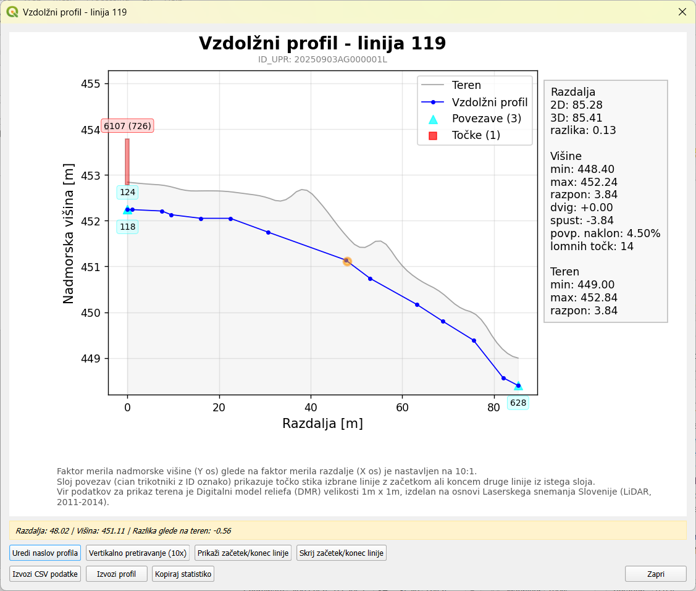

Akcije
========

Akcije so posebni postopki za hitro izvedbo določenih nalog vezanih na podatke v projektu. Delimo jih na akcije za posamezen **sloj** in
na akcije za posamezni **element** določenega sloja.

Akcije za sloje
-----------------

Akcije za sloje se izvajajo nad celotnim slojem. Sprožimo jih preko **podatkovne tabele** sloja.
Na voljo so akcije za navedene sloje:

- :ref:`prekrite_linije`

Akcije za elemente
-------------------

Akcije za elemente se izvajajo nad posameznimi elementi v sloju. Sprožimo jih z **desnim miškinim klikom na lokacijo elementa** sloja iz projekta.

   .. figure:: img/akcije_trase.png

      Prikaz akcij za trase (linije) elektronskih komunikacij

|actionDiff| Izpiši spremembe
~~~~~~~~~~~~~~~~~~~~~~~~~~~~~~

Na voljo za sloje iz elaborata: **Točke**, **Linije** in **Poligoni**.

Akcija izpiše polja in vrednosti, ki so bila spremenjena glede na stanje v bazi (t.j. v zbirnem katastru GJI). Deluje za elemente, ki imajo
tip spremembe **S** ali **B**.

   .. figure:: img/izpis_sprememb.png

      Primer izpisa sprememb za linijo

   .. tip::
    Kadar želimo paketno pridobiti spremembe za vse spremenjene elemente sloja, uporabimo orodje :ref:`analiza`.

|actionUndo| Povrni spremembe (Undo)
~~~~~~~~~~~~~~~~~~~~~~~~~~~~~~~~~~~~~~~~~~~~

Na voljo za sloje iz elaborata: **Točke**, **Linije** in **Poligoni**.

Akcija povrne spremembe na spremenjenem ali brisanem elementu in mu nastavi tip spremembe na **N**.

   .. tip::
    Kadar želimo paketno povrniti izbrane elemente sloja, uporabimo orodje :ref:`undo`.

.. _vzdolzni_profil:

|actionLineProfile| Vzdolžni profil
~~~~~~~~~~~~~~~~~~~~~~~~~~~~~~~~~~~~

Na voljo za sloje iz elaborata: **Linije**.

Akcija v samostojnem oknu prikaže interaktivni vzdolžni (višinski) profil izbrane linije z naborom dodatnih informacij in možnosti.
Horizontalna os (X) prikazuje razdaljo linije, vertikalna os (Y) pa nadmorsko višino.

    Primer vzdolžnega profila linije (trase) v zemlji

**Vsebina profila:**

- **Modra linija** - višinski profil linije z označenimi lomnimi točkami
- **Siva polnitev** - digitalni model reliefa (DMR s celico 1m x 1m)
- **Cian trikotniki** - točke stika z drugimi linijami
- **Rdeči pravokotniki** - točkovni objekti na liniji z ustrezno višino na podlagi Z koordinate in polja DIM_Z.

**Statistika:**

- razdalja linije (2D, 3D, razlika)
- višinske točke linije (minimum, maksimum, razpon, dvig, spust, povprečni naklon, število lomnih točk)
- teren (minimum, maksimum, razpon)

Interaktivne funkcije
**********************

**Sledenje miške:**

- Premik miške po grafu prikaže oranžno točko na karti
- Statusna vrstica: trenutna razdalja, višina, razlika do terena

**Možnosti:**

- **Uredi naslov profila** - sprememba naslova profila v prikazu in izvozu
- **Vertikalno pretiravanje (XX)** - prilagoditev razmerja med horizontalno in vertikalno osjo (0,1x - 10x)
- **Prikaži začetek/konec** - označi začetno (zelena) in končno (rdeča) točko linije na karti
- **Izvozi CSV podatke** - izvoz tabele lomnih točk, povezav in objektov
- **Izvozi profil** - izvoz v PNG, PDF, SVG, DXF
- **Kopiraj statistiko** - kopiranje statistike v odložišče

.. _prerez_trase:

|actionCrossSection| Prerez trase s cevmi in kabli
~~~~~~~~~~~~~~~~~~~~~~~~~~~~~~~~~~~~~~~~~~~~~~~~~~

Na voljo za sloje iz elaborata **Elektronskih komunikacij**: **Linije** (trase).

   .. figure:: img/prerez_trase.png

      Primer trase s cevjo in dvema optičnima kabloma

V pripravi!

.. |actionDiff| image:: /_static/common/actionDiff.svg
   :width: 1.2em
   :class: no-scaled-link

.. |actionUndo| image:: /_static/common/actionUndo.svg
   :width: 1.2em
   :class: no-scaled-link

.. |actionLineProfile| image:: /_static/common/actionLineProfile.svg
   :width: 1.2em
   :class: no-scaled-link

.. |actionCrossSection| image:: /_static/common/actionCrossSection.svg
   :width: 1.2em
   :class: no-scaled-link