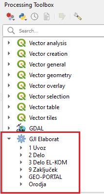

.. _orodja:

Orodja
======

Orodja predstavljajo glavnino dela z vtičnikom in so dostopna preko menija :menuselection:`Processing --> Toolbox` kot skupina :guilabel:`GJI ELaborat`, ki je razdeljena na posamezne podskupine.

   Processing Toolbox in GJI Elaborat

.. _uvoz:

1 Uvoz
--------

V pripravi

2 Delo
------

V pripravi

3 Delo EL-KOM
-------------

V pripravi

9 Zaključek
-----------

V pripravi

GEO-PORTAL
----------

V pripravi

Orodja
------

V pripravi

