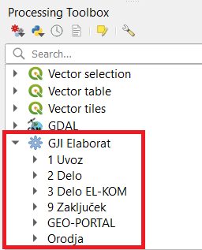
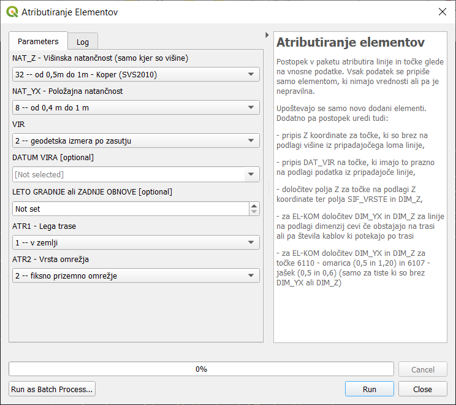
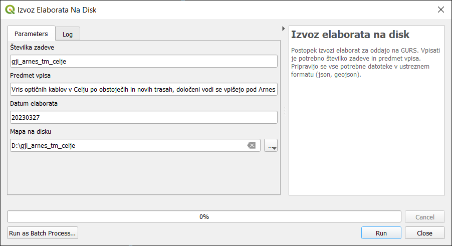

.. _orodja:

Orodja vtičnika
===============

Orodja predstavljajo glavnino dela z vtičnikom in so dostopna preko menija :menuselection:`Processing --> Toolbox` kot skupina :guilabel:`GJI ELaborat`, ki je razdeljena na posamezne podskupine.

   Processing Toolbox in GJI Elaborat

.. _uvoz:

1 Uvoz
--------

Orodja za uvoz podatkov v elaborat (skupina ELABORAT V PRIPRAVI). Ločimo dve vrsti uvoza podatkov:

#. Uvoz lokalnih slojev:
    - Uvoz elaborata iz diska (novi elementi + obstoječi brisani in spremenjeni)
    - Uvoz novih 3D točk
    - Uvoz novih linij (2D ali 3D)
    - Uvoz višin za pripis 2D linijam
#. Uvoz obstoječega stanja zbirnega katastra GJI v evidenci GURS glede na 3 načine (filter, območje, razdalja)

2 Delo
------

Orodja za paketno obdelavo podatkov, ki se že nahajajo v elaboratu:

- Razbijanje linij na različne načine, kjer se atributi osnovne linije prenesejo na novo nastale z razbijanjem.
- Snap obstoječih linij na nove

3 Delo EL-KOM
-------------

Orodja za paketno obdelavo podatkov elaborata elektronskih komunikacij:

- Dodajanje cevi in kablov na različne načine
- Generiranje hišnih priključkov
- Preračun omrežja (network)

9 Zaključek
-----------

Atributiranje elementov
~~~~~~~~~~~~~~~~~~~~~~~

Orodje za paketno atributiranje elementov, ki so brez podatkov v določenih poljih in jim želimo vpisati enake podatke v enem koraku.

   Atributiranje elementov za projekt elektronskih komunikacij

Dodatno pa postopek atributiranja izvede tudi naslednje obdelave podatkov:

- pripis Z koordinate za točke, ki so brez višine na podlagi višine iz pripadajočega loma linije
- pripis DAT_VIR na točke, ki imajo to prazno na podlagi podatka iz pripadajoče linije
- določitev polja Z za točke na podlagi Z koordinate ter polja SIF_VRSTE in DIM_Z
- za EL-KOM določitev DIM_YX in DIM_Z za linije na podlagi dimenzij cevi če obstajajo na trasi ali pa števila kablov ki potekajo po trasi
- za EL-KOM določitev DIM_YX in DIM_Z za točke 6110 - omarica (0,5 in 1,20) in 6107 - jašek (0,5 in 0,6) (samo za tiste ki so brez DIM_YX ali DIM_Z)

Izvoz elaborata na disk
~~~~~~~~~~~~~~~~~~~~~~~

Izvoz podatkov za oddajo na GURS. Vpiše se številka zadeve in predmet vpisa, ki se shranijo v bazi za kasnejše izvoze.

Pripravijo se vse potrebne datoteke v ustreznem formatu (GeoJSON in JSON).

Dodatno se vsem izvoženim elementom v bazi zapiše točen datum izvoza.

GEO-PORTAL
----------

V pripravi

Orodja
------

V pripravi

