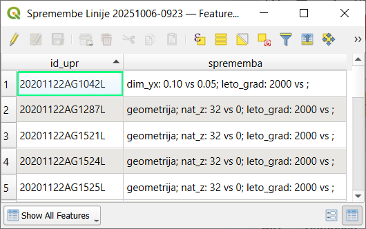

.. _orodja:

Orodja vtičnika
===============

Orodja predstavljajo glavnino dela z vtičnikom in so dostopna preko menija :menuselection:`Processing --> Toolbox` kot skupina :guilabel:`GJI ELaborat`, ki je razdeljena na posamezne podskupine.

   Processing Toolbox in GJI Elaborat

.. _uvoz:

1 Uvoz
--------

Orodja za uvoz podatkov v elaborat (skupina ELABORAT V PRIPRAVI). Ločimo tri vrste uvoza podatkov:

.. _uvoz_elaborata:

1.1 Uvoz elaborata
~~~~~~~~~~~~~~~~~~~

    Uvozijo se datoteke že izdelanega elaborata iz lokalne mape z vsemi tipi sprememb (novi, spremenjeni, brisani) in atributi iz posameznih slojev.

    .. warning::
     Mapa lahko vsebuje podatke v starem SHP formatu ali novem GeoJSON, vendar pa mora ena mapa vsebovati samo en format.

.. _uvoz_lokalnih_slojev:

1.2 Uvoz lokalnih slojev
~~~~~~~~~~~~~~~~~~~~~~~~

    Najlažje je uvoziti lokalne sloje, ki so že v projektu. Možno pa je tudi izbrati pot do sloja na disku. Za uvoz atributnih
    podatkov sloja je pomembno da se polja ujemajo s polji v bazi - :ref:`struktura`.

    .. important::
     Podatki se uvozijo kot novo dodani (D), razen kadar sloj vsebuje polje ``ID_UPR``. V tem primeru se izvede kontrola
     na podlagi primerjave vrednosti polja ``ID_UPR`` objekta ki se uvaža in bazo. Če vrednost ne obstaja v bazi se element
     uvozi kot D, če obstaja in v primeru razlike v podatkih ali geometriji pa se uvozi iz baze ter ustrezno spremeni (S).

    .. tip::
     Kadar želimo uvoziti tudi objekte, ki so namenjeni brisanju, mora sloj vsebovati polje ``TIP_SPR`` in objekti za brisanje
     vrednost **B**.

    **Uvoz točk (3D)**

        Izberemo točkovni sloj za uvoz ter določimo šifro objektov GJI. Kadar so vsi objekti v sloju istega tipa vpišemo
        pripadajočo šifro GJI, kadar pa imamo različne objekte, ki imajo ustrezno šifro določeno v polju, pa uporabimo dodatne
        možnosti, kjer izberemo to polje. Postopek je prikazan na primeru uporabe orodja :ref:`setz`.

        .. tip::
         V primeru, da imamo samo 2D sloj in višine pripisane v atributni tabeli uporabimo orodje :ref:`setz` za kreiranje 3D sloja.

    **Uvoz linij ali poligonov**

        Izberemo linijski ali poligonski sloj za uvoz. Uvozimo lahko tudi 2D podatke in z ločenim postopkom še višine, če jih imamo.
        Opcijsko lahko vpišemo tudi kdo je meritve izvajal, kar se bo zapisalo v polje ``MERIL``.

    **Uvoz višin**

        Izberemo točkovni sloj z višinami ter označimo ali so višine za linije ali poligone.

        .. note::
         V primeru da sloj višin vsebuje polje ``ID_UPR`` se bodo višine pripisale pripadajočim objektom glede na vrednost polja ``ID_UPR``,
         drugače pa izključno glede na lokacijo. V vsakem primeru se morajo točke za pripis višin nahajati na lomnih točkah linije ali poligona
         oz. znotraj minimalne tolerance.

        .. warning::
         V primeru da ima linija ali poligon na točki iz izbranega sloja že obstoječo višino se bo ta zamenjala z novim podatkom!!

1.3 Uvoz podatkov GURS
~~~~~~~~~~~~~~~~~~~~~~~

    S temi postopki uvozimo obstoječe stanje zbirnega katastra GJI v elaborat za nadaljnjo obravnavo. Vsi podatki se uvozijo kot
    nespremenjeni (N).

    .. note::
     Vedno se pri uvozu upoštevajo podatki vrste infrastrukture ter privzetega upravljavca iz nastavitev projekta.

    Izbiramo lahko med 3 različnimi načini uvoza podatkov GURS:
        - FILTER (vnesemo atributni filter na podlagi katerega se izberejo in uvozijo elementi)
        - OBMOČJE (določimo pravokotnik kot območje uvoza)
        - RAZDALJA (določimo razdaljo v metrih od novo dodanih linij v elaboratu)

    .. warning::
     Postopki uvoza podatkov GURS lahko trajajo več minut. Pri določitvi območja uvoza s pravokotnikom označimo samo območje potrebno za izdelavo elaborata!

.. _delo:

2 Delo
------

Orodja za obdelavo podatkov, ki se že nahajajo v elaboratu:

- Brisanje vseh podatkov v elaboratu (ponastavitev na začetno stanje)
- Brisanje podvojenih linij (možnost ignoriranja usmeritve linij, prenos cevi in kablov za projekte Elektronskih komunikacij)
- Razbijanje linij na različne načine, kjer se atributi osnovne linije prenesejo na novo nastale z razbijanjem.
- Snap obstoječih linij na nove

3 Delo EL-KOM
-------------

Orodja za obdelavo podatkov elaborata elektronskih komunikacij:

- Dodajanje cevi in kablov na različne načine
- Podaljšanje kabla za izbrane cevi/trase
- Generiranje hišnih priključkov
- Preračun omrežja (network)

.. _zakljucek:

9 Zaključek
-----------

9.1 Analiza spremenjenih elementov
~~~~~~~~~~~~~~~~~~~~~~~~~~~~~~~~~~

Postopek v tabelo zapiše v enotno polje spremembe za vsak spremenjen element sloja.

V primeru da element nima sprememb se mu tip spremembe nastavi na **N** (nespremenjen).

.. _atributiranje:

9.2 Atributiranje elementov
~~~~~~~~~~~~~~~~~~~~~~~~~~~~

Orodje za paketno atributiranje elementov, ki so brez podatkov v določenih poljih in jim želimo vpisati enake podatke v enem koraku.
Ta polja so:

- ``NAT_Z`` - Točnost določitve višine
- ``NAT_YX`` - Točnost določitve položaja
- ``VIR``
- ``DAT_VIR`` - Datum vira
- ``LETO_GRAD`` - Leto gradnje oz. zadnje obnove

V primeru elektronskih komunikacij še:

- ``ATR1`` - Lega trase
- ``ATR2`` - Vrsta omrežja

   Atributiranje elementov za projekt elektronskih komunikacij

Dodatno pa postopek atributiranja izvede tudi naslednje obdelave podatkov:

- pripis Z koordinate za točke, ki so brez višine na podlagi vrednosti polja ``Z``, če je večje od 0
- pripis Z koordinate za točke, ki so brez višine na podlagi višine iz pripadajočega loma linije
- pripis ``DAT_VIR`` in ``LETO_GRAD`` na točke, ki imajo to prazno na podlagi podatka iz pripadajoče linije
- izračun polja ``LETO_GRAD``, kjer je prazno, za točke in linije na podlagi polja ``DAT_VIR``,
- določitev polja ``Z`` za točke na podlagi Z koordinate ter polja ``SIF_VRSTE`` in ``DIM_Z``,
- usklajevanje polj ``NAT_YX`` in ``VIR`` glede na pravila GURS-a,
- za EL-KOM določitev ``DIM_YX`` in ``DIM_Z`` za linije na podlagi dimenzij cevi če obstajajo na trasi ali pa števila kablov ki potekajo po trasi
- za EL-KOM določitev ``DIM_YX`` in ``DIM_Z`` za točke 6110 - omarica (0,5 in 1,20) in 6107 - jašek (0,5 in 0,6) (samo za tiste ki so brez ``DIM_YX`` ali ``DIM_Z``)

.. _izvoz:

9.3 Izvoz elaborata na disk
~~~~~~~~~~~~~~~~~~~~~~~~~~~~

Izvoz podatkov za oddajo na GURS. Vpiše se številka zadeve in predmet vpisa, kar se shrani v bazi za kasnejše izvoze.

.. image:: img/izvoz.png

Pripravijo se vse potrebne datoteke v ustreznem formatu (GeoJSON in JSON). Dodatno se kreira tudi kompresirana ZIP datoteka,
skladno z navodili GURS.

.. note::
 Izvoz omogoča kreiranje **več elaboratov naenkrat**, glede na vpisane matične številke upravljalcev za elemente (linije, točke, poligone)
 v polju ``MAT_ST``.

 To pomeni da lahko večji uporabniki (npr. komunalna podjetja), ki vodijo svoj operativni kataster in so izvajalci GJS na območju več različnih upravljavcev (občin),
 uvozijo vse svoje podatke paketno v isti projekt in jih nato v enem koraku tudi izvozijo za oddajo na GURS.

 Potrebno je samo zagotoviti pravilen vpis matičnih številk.

.. warning::
 Izvozijo se samo elementi, ki imajo vpisan pravilen podatek o matični številki upravljavca. Če podatka ni, oz. če ne obstaja v evidenci
 poslovnih subjektov, se takšni elementi ne izvozijo.

 Posebnost pri tem pravilu je matična številka 9999999, ki pomeni neznane lastnike hišnih priključkov za vodovod. Podatki s to
 matično št. se izvozijo v ločen elaborat!

 .. figure:: img/izvoz_report.png

    Izvoz več elaboratov z opozorilom o neobstoječih matičnih številkah

Dodatno se vsem izvoženim elementom v bazi zapiše datum in čas izvoza.

9.4 Povrnitev spremenjenih in brisanih elementov (Undo)
~~~~~~~~~~~~~~~~~~~~~~~~~~~~~~~~~~~~~~~~~~~~~~~~~~~~~~~~

Postopek povrne izbrane spremenjene in brisane elemente na prvotno stanje in jim nastavi tip spremembe N.

GEO-PORTAL
----------

Orodja za prenos podatkov na GEO-PORTAL in druge povezane akcije za določene naročnike, ki uporabljajo to storitev.

Orodja
------

Vsebuje orodja, ki ne spreminjajo podatkov v elaboratu in se lahko uporabljajo tudi izven pripadajočega projekta za GJI.

.. _kontrola_lidar:

Kontrola in poprava točk (LiDAR, geoid)
~~~~~~~~~~~~~~~~~~~~~~~~~~~~~~~~~~~~~~~

Za točkovni sloj izvede pripis višin iz Digitalnega modela reliefa (DMR), ki je bil generiran iz podatkov LiDAR in predstavlja
najbolj natančne podatke o reliefu za celotno državo.

V primeru, da je vhodni sloj v 3D obliki (PointZ) izračuna tudi razliko med originalno višino in višino iz DMR.

Dodana je možnost preračuna višin na podatke geoida (SVS2010, datum Koper), v primeru da vsebuje vhodni sloj
elipsoidne višine.

.. image:: img/kontrola_tock.png

.. _napni_linije_lidar:

Napni linije na DMR (LiDAR)
~~~~~~~~~~~~~~~~~~~~~~~~~~~

Postopek elementom linijskega sloja določi Z koordinato za vsako lomno točko na podlagi Digitalnega modela reliefa (DMR).

Opcijsko lahko podamo parameter odmik ki se bo upošteval pri vseh višinah.

.. tip::
 Za upoštevanje globine je potrebno vpisati negativno številko!.

Rezultat je nov sloj tipa LineStringZ z višinami iz DMR.

Pridobi višino posamezne točke iz DMR (LiDAR)
~~~~~~~~~~~~~~~~~~~~~~~~~~~~~~~~~~~~~~~~~~~~~

Postopek za podano točko vrne informacijo o višini na podlagi podatkov DMR (LiDAR).

.. _uvoz_shp_zip:

Uvoz in prikaz SHP podatkov iz množice ZIP datotek
~~~~~~~~~~~~~~~~~~~~~~~~~~~~~~~~~~~~~~~~~~~~~~~~~~

Postopek iz podane mape na disku iz vsake ZIP datoteke uvozi in združi SHP datoteke z istim imenom ter jih prikaže v legendi.
Postopek doda polje ``DAT_VIR`` (datum datoteke) in ``DELO`` (ime zip datoteke).

.. tip::
 Primerno za uvoz in prikaz terenskih podatkov pred nadaljno obdelavo!