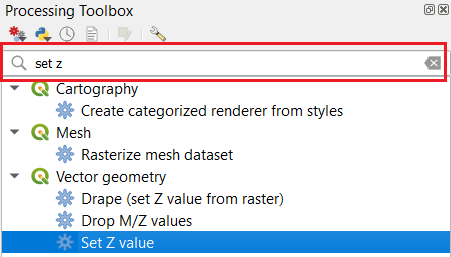
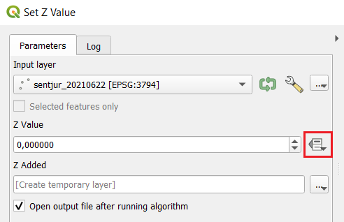
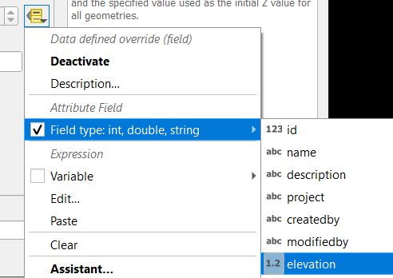

.. _qgis-orodja:

Izbrana QGIS orodja
===================

Opisana so nekatera standardna orodja, ki so vključena v QGIS in jih potrebujemo pri delu z vtičnikom. Orodja so del
"Processing Toolbox"-a (meni :menuselection:`Processing --> Toolbox`), kjer so razdeljena v več skupin. Najlažje jih poiščemo z iskalnikom.

   Iskanje orodja

.. _setz:

Set Z value
-----------

Orodje izbranemu točkovnemu sloju določi Z vrednost, tako da je rezultat 3D sloj. Tipično se določi Z vrednost na podlagi vrednosti v določenem polju.

   Za določitev Z na podlagi vrednosti polja, uporabimo dodatne možnosti

   Nato izberemo :menuselection:`Field type...' --> [IME POLJA]`

3D točkovni sloj potrebujemo pri uvozu točk in višin ter kadar rišemo novo 3D linijo na podlagi 3D točk.
